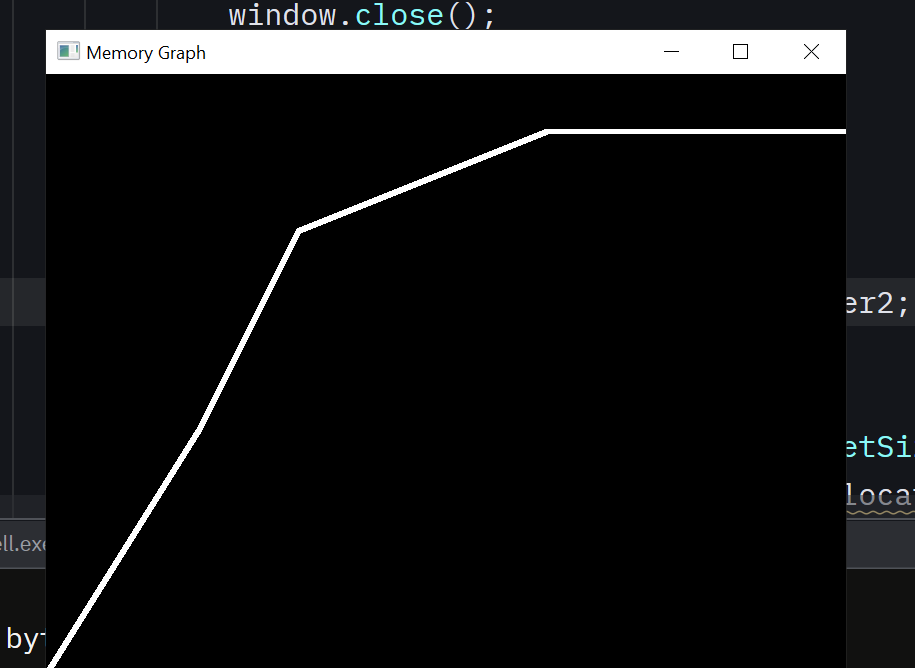

# simple memory usage visualizer

this program overloads the new and delete keywords to add incrementing and decrementing the totalAllocated varible, therefor tracking memory usage.

then it uses SFML to draw for every frame a point with the totalAllocated variable as the height, making a graph.
